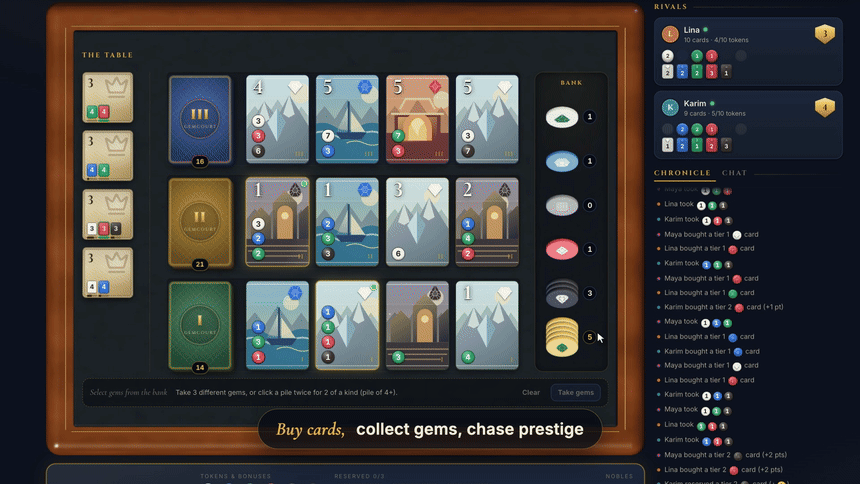
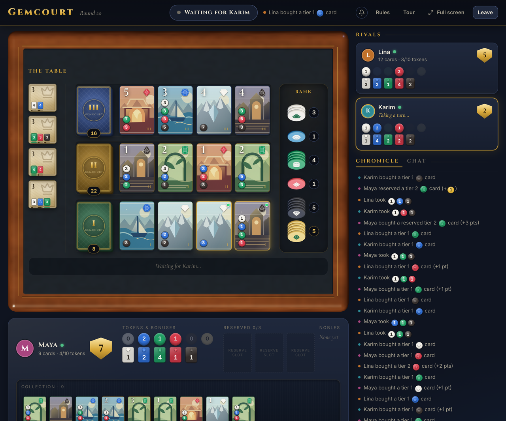
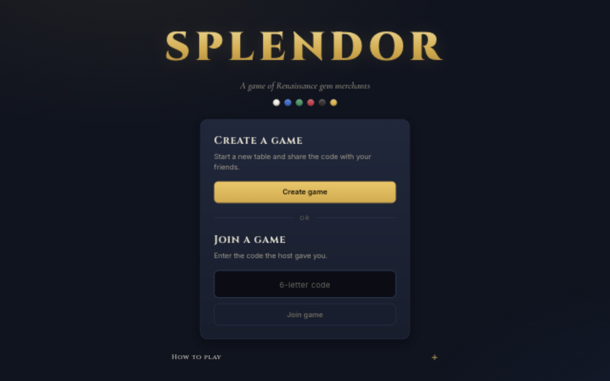
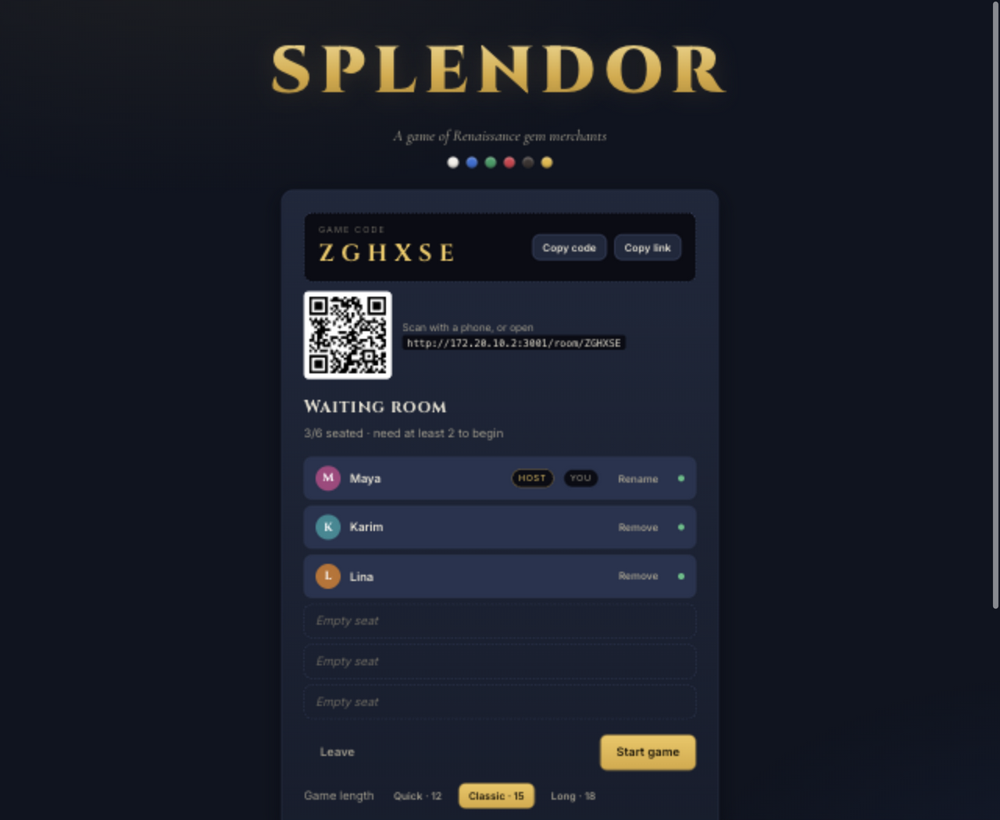
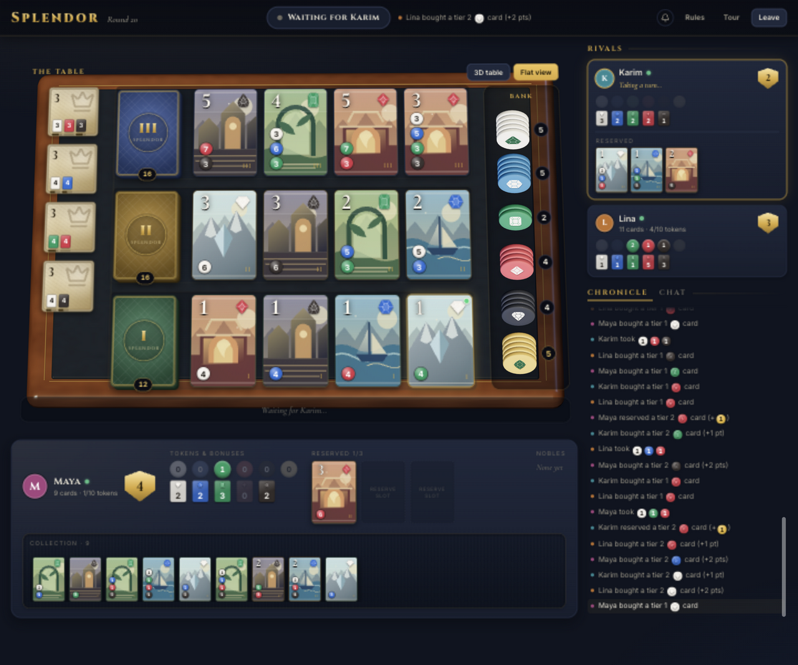

# Gemcourt (local multiplayer)

**Gemcourt** is a local-network gem-trading card game for the browser, inspired by the board game Splendor
(standard base-game rules for 2–4 players, extended to 5–6), built with TanStack Start + React. Your machine is
the server; everyone plays in a browser, on your Wi-Fi or, with `pnpm play:online`, from anywhere.

> **Disclaimer:** Gemcourt is a fan-made, unofficial implementation inspired by the board game Splendor.
> It is not affiliated with, endorsed by, or sponsored by Space Cowboys or Asmodee.
> Splendor is a trademark of its respective owner.

<!--
  GitHub only shows an inline video player for files uploaded through its web UI.
  For one: edit this README on github.com, drag docs/videos/splendor-showcase.mp4 into the editor,
  and replace the link below with the generated https://github.com/user-attachments/... URL.
  The video, its GIF preview and the screenshots below were captured before the rename to Gemcourt,
  so they still show the old title; re-record with scripts/showcase-video/ to refresh them.
-->
[](docs/videos/splendor-showcase.mp4)

[▶ Watch the 25-second showcase video](docs/videos/splendor-showcase.mp4)



## App previews

Screenshots from the running app, showing the journey from opening a table to a game in progress.

### Create or join a game

Start a new table or enter a friend's six-letter game code.



### Live waiting room

Share the room code, invite link, or QR code. Connected players appear at the table;
the host chooses the winning score and starts when everyone is ready.



### A game in progress

The **3D table** above shows a match after several rounds, with purchased cards,
reserved cards, gem balances, and scores. Switch to **Flat view** for a close-up
of the same card market and token bank. Rival panels and the chronicle update as players take turns.



These previews were captured locally. To play live with friends, follow the setup below;
`pnpm play:online` generates a new public invitation URL for each session.

## Run it

```bash
pnpm install
pnpm dev        # dev server on http://localhost:3000 (also reachable from your LAN)
```

Production-style run (faster, no hot reload):

```bash
pnpm play       # build + serve on port 3000
```

When the server starts, the terminal prints a **QR code** of your network address — players on the
same Wi-Fi scan it with their phone camera and land straight on the game (no typing URLs).

Open `http://localhost:3000`, click **Create game**, share the 6-letter code.
Friends on the same Wi-Fi open `http://<your-LAN-IP>:3000` (shown in the waiting room), click **Join game**,
enter the code and pick a display name. The host (first to sit down) starts the game once 2–6 players are seated.

### Playing with people outside your network

```bash
pnpm play:online   # build + serve + open a public tunnel
```

This opens a free [Cloudflare Quick Tunnel](https://developers.cloudflare.com/cloudflare-one/connections/connect-networks/do-more-with-tunnels/trycloudflare/)
(no account needed). The terminal prints a public `https://….trycloudflare.com` address with a big QR code;
share that link (or the waiting room's **Copy link**, which uses it automatically). The LAN address keeps working
alongside it.

- The address is **random and changes every time** you start the server, so share the new one each session.
- The `cloudflared` binary comes with the `cloudflared` npm package (downloaded on `pnpm install`; if it's missing,
  it's fetched on first use). If the tunnel can't start, the server keeps running LAN-only and says so.
- Quick tunnels are meant for testing and casual use: no uptime guarantee, and it may take a few seconds after the
  URL appears before it answers.

Tip: to test alone, open several browser tabs — each tab is a separate player.

## Rules implemented

- Setup: gem piles of 4 / 5 / 7 / 8 / 9 for 2 / 3 / 4 / 5 / 6 players; 5 gold (6 for 5 players, 7 for 6);
  players + 1 nobles; 4 face-up cards per tier. 5–6 players is a house extension of the 2–4 player base game
  (same decks).
- One action per turn:
  - take 3 gems of different colors (fewer only if fewer colors remain), or
  - take 2 gems of one color if that pile has at least 4, or
  - reserve a face-up card or the top card of a deck (max 3 reserved) and gain 1 gold if available, or
  - buy a face-up or reserved card (card bonuses discount the cost, gold is wild).
- Hold at most 10 tokens at the end of a turn — excess must be returned.
- Nobles (3 points) visit at the end of your turn when your card bonuses meet their requirement; one per turn,
  you choose if several qualify.
- Reaching 15 points triggers the final round so everyone gets the same number of turns. Highest score wins;
  tie goes to the player with the fewest purchased cards, otherwise a shared victory.
- Blind-reserved cards stay hidden from opponents.
- If a player truly has no legal move (bank empty, 3 reserved, nothing affordable) they may pass.

## Disconnects

- Closed your tab? Open the game link again and join with the **same name** to reclaim your seat
  (possible once you've been gone ~5 seconds, so a quick refresh never gets merged with someone else).
- If the player whose turn it is has been offline for ~8 seconds, anyone at the table can **skip their turn**
  so the game keeps going (any tokens over 10 are returned for them).
- If the host has been offline for a few seconds, any other player can start / restart the game and becomes host.
- The host can't start while a seated player is offline (remove them or wait).
- A device that drops off the network without closing the page (e.g. a phone leaving Wi-Fi) shows as
  offline within ~30 seconds (its socket stops answering pings), and comes back online as soon as it reconnects.

## Security

- On your Wi-Fi, anyone on the network who knows a game code can join that game.
- With `pnpm play:online`, **anyone with the public link and a game code can join**. Codes are 6 random letters
  (~190 million combinations) and guessing is rate-limited, but treat the link like an invitation.
- Seats are protected only by name (no accounts): someone who knows a player's name can take that seat once its
  owner has been offline for a few seconds. Fine for friends; don't use it for anything that matters.
- Abuse limits (in memory, per client IP; the host machine's own tabs are exempt): 10 new games per 10 minutes,
  20 join attempts / unknown-code lookups per minute, 20 open connections, ~30 messages per second per connection
  (flooding closes the socket), 16 KB per message, and at most 500 games on the server. Games nobody sits down in
  are removed after 10 minutes.

## Scripts

| Command            | What it does                                                       |
| ------------------ | ------------------------------------------------------------------ |
| `pnpm dev`         | Dev server with hot reload                                         |
| `pnpm play`        | Build and serve production build                                   |
| `pnpm play:online` | `play` plus a public Cloudflare tunnel (link + QR in the terminal) |
| `pnpm test`        | Unit tests: rules engine, rate limits (vitest)                     |
| `pnpm typecheck`   | TypeScript check                                                   |

## Layout

- `src/game/` — pure rules engine (`types.ts` contract, `engine.ts`, card + noble data, tests)
- `src/server/rooms.ts` — in-memory rooms, lobby, per-player views
- `src/server/socket.ts` — the WebSocket (`/ws`): pushes room views, carries every game op (request id → result)
- `src/server/limits.ts` — rate limits; `src/server/runtime.ts` — state shared with the Vite plugins
- `src/routes/api/rooms/*` — HTTP endpoints for creating a game and looking one up
- `plugins/` — Vite plugins: WebSocket upgrade (dev + preview), LAN QR code, Cloudflare tunnel
- `src/routes/` — home (create / join), `/room/$code` (join form, waiting room, game)
- `src/components/` — lobby and board UI

Game state is kept in memory: restarting the server ends all games.

## Interactive 3D table and Blender assets

The game opens in **3D table** view: drag the felt to change the viewing angle,
scroll or pinch to zoom, and use **Top view** or **Reset view** to frame the board.
Click a card to buy or reserve it, or click a gem stack to select tokens. Selected
coins move to the front of the board; click them to put them back. The usual
**Take gems** button confirms the move. **Flat view** keeps the original layout,
and is also used automatically if WebGL or an asset cannot load. Keyboard users
can tab through the pieces in 3D view; focusing a piece raises it and shows its
name and card cost.

The walnut/felt board, solid-color matte coins with contrasting printed gem symbols, and rounded card stock are made
in Blender and exported to `public/models/`. Each coin has a distinct faceted gem cut
(diamond, sapphire, emerald, ruby, onyx, or the marquise gold wildcard); the outlines
in `src/components/game/gemShapes.json` are shared by Blender, flat glyphs, and 3D card faces.
All six coin variants are bundled in one 79 KB GLB. The card faces use the app's original
artwork and current game data. No external textures or asset services are needed.
Editable sources are in `assets/blender/splendor_board.blend` and
`assets/blender/splendor-pieces.blend`.

To regenerate the integrated assets (tested with Blender 5.2.2):

```bash
blender --background --python assets/blender/create_splendor_board.py
blender --background --python assets/blender/create_table_pieces.py
```

On macOS, replace `blender` with
`/Applications/Blender.app/Contents/MacOS/Blender` if it is not on your PATH.

The four Blender skills and their references are checked into `.agents/skills/`.
Three.js and its TypeScript definitions are pinned in `pnpm-lock.yaml`.
`scripts/blender/create_assets.py` is a separate optional generator for product
renders and a collector display; those assets are not used by the game table.

## License

Gemcourt's source code is released under the [MIT License](LICENSE). The license covers this project's own code and
assets only; it grants no rights to the Splendor name or any third-party trademarks.
